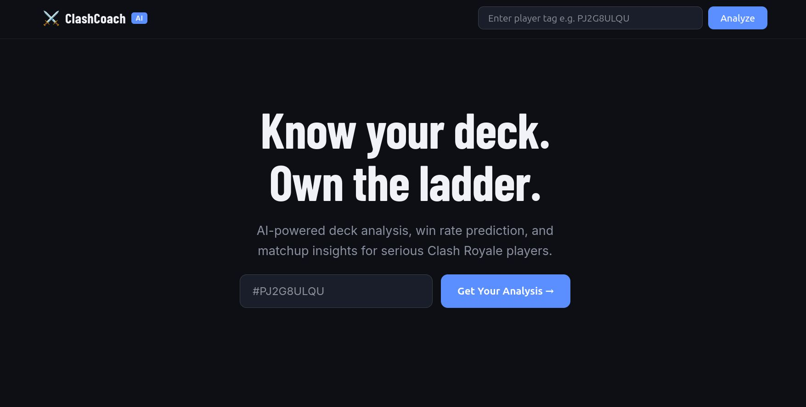
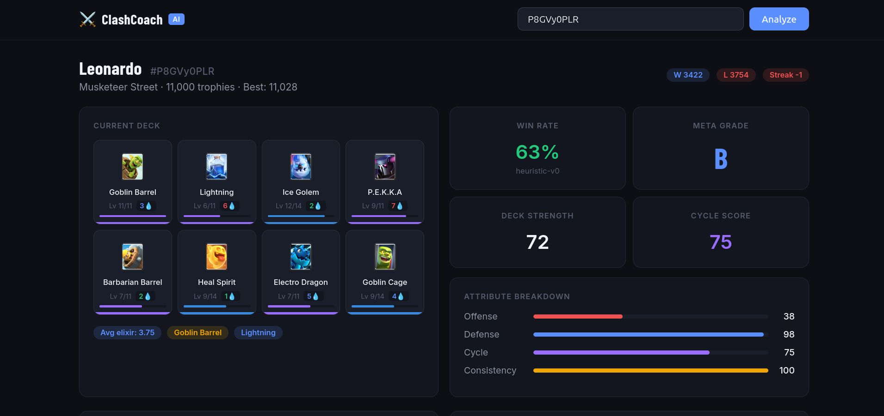

# ⚔️ ClashCoach

> AI-powered Clash Royale deck analyzer — win rate prediction, matchup insights, and progression coaching for serious players.


---


## What is ClashCoach?

ClashCoach pulls your live Clash Royale data via the official CR API and runs it through an ML pipeline to give you:

- **Deck strength scoring** — offense, defense, cycle, consistency breakdown
- **Win rate prediction** — heuristic now, XGBoost model as battle data grows
- **Matchup analysis** — which archetypes counter you and by how much
- **Progression tracking** — battle history, trophy trends, card level gaps
- **Multi-token API pool** — friends can contribute their API tokens to power richer data

---

## Architecture

```
React Frontend (Vercel)
        │
        │ REST API
        ▼
FastAPI Backend (Docker)
  ├── CR API Router       → Clash Royale official API
  ├── ML Inference Router → Win rate + matchup predictions  
  ├── Token Pool Manager  → Round-robin across multiple API keys
  └── Admin Router        → Runtime token management
        │
   ┌────┴────┐
   │         │
Redis      PostgreSQL
(cache)    (battle data)
        │
        ▼
   ML Pipeline
  ├── Feature Engineering  → Deck vectors, elixir curves, synergy scores
  ├── Win Predictor        → XGBoost / LightGBM (heuristic → trained)
  ├── Deck Scorer          → Card embeddings + cosine similarity
  ├── Matchup Model        → Matrix factorization on deck vs deck win rates
  └── Play Clustering      → K-Means on battle sequences
```

---

## Tech Stack

| Layer | Technology |
|-------|-----------|
| Frontend | React 18, Axios |
| Backend | FastAPI, Python 3.12 |
| Cache | Redis 7 |
| Database | PostgreSQL 16 |
| ML | Scikit-learn, XGBoost (roadmap) |
| DevOps | Docker, Docker Compose |
| Deployment | Vercel (frontend), Railway (backend) |

---

## Quick Start

### Prerequisites
- Docker + Docker Compose
- Node.js 18+
- Clash Royale API token → [developer.clashroyale.com](https://developer.clashroyale.com)

### Run locally

```bash
# Clone
git clone https://github.com/bhargav-chataut/ClashCoach.git
cd ClashCoach

# Backend
cd cr-analyzer
cp .env.example .env
# Add your CR API token to .env
docker compose up --build

# Frontend (new terminal)
cd ../frontend
npm install
npm start
```

- Backend API: http://localhost:8000
- API Docs: http://localhost:8000/docs
- Frontend: http://localhost:3000

---

## Key Endpoints

| Method | Endpoint | Description |
|--------|----------|-------------|
| GET | `/api/players/{tag}` | Player profile + stats |
| GET | `/api/players/{tag}/battles` | Last 25 battles |
| GET | `/api/decks/{tag}/current` | Current deck + feature scores |
| POST | `/api/ml/analyze-deck` | Full ML analysis |
| POST | `/api/ml/matchups` | Counter matchup data |
| POST | `/api/admin/tokens/add` | Add friend's API token at runtime |

---

## ML Upgrade Path

The predictor module is designed as a clean swap point:

```
Phase 1 (now) → Heuristic scoring from deck features
Phase 2        → Collect battle data via /battles endpoint → store in PostgreSQL  
Phase 3        → Train XGBoost on (deck_features, opponent_features) → win/loss
Phase 4        → Matrix factorization for matchup win rates
Phase 5        → Card embeddings via co-occurrence in winning decks
```

Router interfaces stay identical — only app/ml/predictor.py internals change.

---

## Multi-Token Pool

Friends can contribute their CR API tokens to power richer data without any code changes:

```bash
curl -X POST https://your-api/api/admin/tokens/add \
  -H "Content-Type: application/json" \
  -d '{"token": "eyJ...", "label": "friend-token"}'
```

The pool round-robins across all tokens with automatic rate limit backoff.

---


## Screenshots





## Roadmap

- [ ] XGBoost win rate model trained on real battle data
- [ ] Deck progression recommendations
- [ ] Tournament meta tracker
- [ ] Clan war strategy assistant
- [ ] Mobile-responsive UI
- [ ] Premium tier — Meta Engine Pass

---

## Author

**Bhargav Chataut**  
[GitHub](https://github.com/bhargav-chataut) · Built with 🎮 and way too much ☕